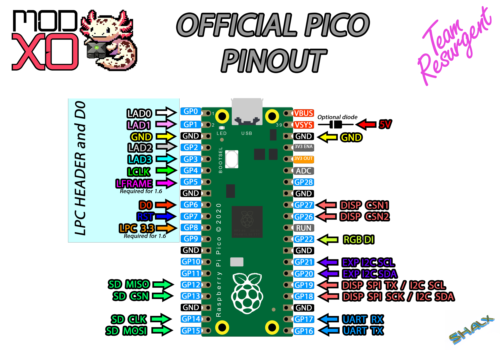

 

[](https://github.com/Team-Resurgent/Repackinator/blob/main/LICENSE.md)
[](https://github.com/Team-Resurgent/Modxo/actions/workflows/BundleModxo.yml)
[](https://discord.gg/VcdSfajQGK)

#Modxo

Modxo (pronounced "Modsho") is an RP2040 firmware that converts a Raspberry Pi Pico (or similar device) into an Original Xbox-compatible LPC peripheral device. 

Modxo can be used for loading an Xbox BIOS image from the LPC port, as well as for interfacing compatible Xbox software with peripheral devices such as HD44780 displays or addressable RGB LEDs.

# How to Install

### 1. Requirements
* An Xbox (any revision) with a working LPC Port. 1.6 Xboxes will need an LPC rebuild.  
* A RP2040 development board. There may be some clone boards that are not compatible. The following boards are known to work with modxo:
- * Official Raspberry Pi Pico
- * YD-RP2040 
- * RP2040 Zero
- * RP-Tiny 
- 
* 4 100 Ohm resistors (tested with 1/4 W resistors) 
 
### 2. Wiring diagrams

#### LPC Header


* Note: D0 is required for versions 1.0 - 1.5 unless it is grounded.
* Note: LFrame and LPC 3.3V connections are required by version 1.6 or when connecting the Pico to USB port.
* Note: LFrame is not required for USB debugging.
* Note: An LPC Rebuild is required for version 1.6

#### Official Pico



* Note: Please add the diode if connecting the Pico to USB. This avoids powering the LPC 5V Pin from the USB cable.

#### YD2040


* Note: Don’t forget to add solder to jumper R68 if using the onboard RGB LED.

### 3. Flashing firmware

#### Packing Bios
1. Go to [https://team-resurgent.github.io/modxo/](https://team-resurgent.github.io/Modxo/)
2. Drag and Drop your bios file
3. UF2 File with bios image will be downloaded

#### Flashing steps
1. Connect Raspberry Pi Pico with BOOTSEL button pressed to a PC and one new drive will appear.
2. Copy Modxo.uf2 into the Raspberry Pi Pico Drive.
3. Reconnect Raspberry Pi Pico with BOOTSEL button pressed, so the previous drive will showup again.
4. Copy your bios UF2 file into the drive

# Firmware Build Instructions

1.- Download and Install [Visual Studio Code](https://code.visualstudio.com/download)

2.- Install extension: "Raspberry Pi Pico"


3.- Ensure SDK 1.5.1 selected as below...


4.- After SDK is installed, git submodules must be updated from command line by running:


**Windows:**

```
cd %HOMEPATH%\.pico-sdk\sdk\1.5.1
git submodule update —init —recursive

```


**Linux:** 
TODO
**MacOS:** 
TODO

5.- Go to Raspberry Pi Pico Tab in VS Code by clicking the Pico icon in the sidebar and from there click "Configure CMake"

6.- Go to Run and Debug Tab and select Build for your board

7.- Click "Start Debugging" (Green arrow)

8.- UF2 File will in the `build` folder generated during the compile process

# Known bugs
 * Windbg get stuck sometimes when connected to Modxo SuperIO's serial port

# Notes
 * Currently, Modxo uses the ID 0xAF. Any derivative hardware with significant changes should ideally use a different ID. This is so that software like PrometheOS can target features appropriately.
 
 
# Attribution Requirement

     a) **Attribution:**  
       If you distribute or modify this work, you must provide proper 
       attribution to the original authors. This includes:
       - Mentioning the original project name: `Modxo`.
       - Listing the original authors: `Shalx / Team Resurgent`.
       - Including a link to the original project repository: 
           `https://github.com/Team-Resurgent/Modxo`.
       - Clearly stating any modifications made.

    b) **Logo and Branding:**  
       Any derivative work or distribution must include the logos provided by
       the original authors in accordance with the branding guidelines. The 
       logos must be displayed prominently in any interface or documentation 
       where the original project is referenced or attributed.

    c) **Branding Guidelines:**  
       You can find the logos and detailed branding guidelines in the 
       `BRANDING.md` file provided with this project. The logos must not be 
       altered in any way that would distort or misrepresent the original 
       branding.
